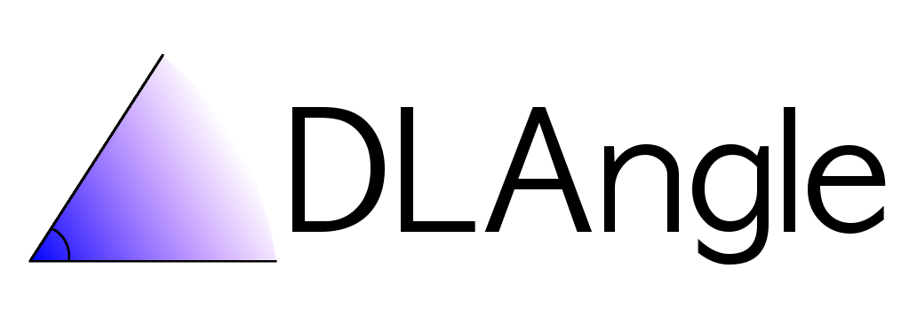

<div align="center" markdown="1">



[](https://github.com/Carthage/Carthage)
[](https://github.com/CocoaPods/CocoaPods)
[](https://swift.org/package-manager/)
[](https://swift.org)
	
</div>


Provides an abstraction for mathematical angle.
Because the angle is a type, errors such as:

* sum or subtract a degree angle with a radian angle
* pass degree angle to a trigonometric function from standard library

are either not possible or catched at compile time.
Support convenience initializers, operators and functions for natural, fast and productive workflow.

## Table of contents

- [Usage](https://github.com/davidlivadaru/DLAngle#usage)
	- [Creation](https://github.com/davidlivadaru/DLAngle#creation)
	- [Converting between Degree and Radian](https://github.com/davidlivadaru/DLAngle#converting-between-degree-and-radian)
	- [Basic Operations](https://github.com/davidlivadaru/DLAngle#basic-operations)
	- [Normalization](https://github.com/davidlivadaru/DLAngle#normalization)
	- [Equality](https://github.com/davidlivadaru/DLAngle#Equality)
	- [Comparison](https://github.com/davidlivadaru/DLAngle#comparison)
	- [Foundation.Measurement conversion](https://github.com/davidlivadaru/DLAngle#foundation-measurement-conversion)
	- [Inverse trigonometric functions](https://github.com/davidlivadaru/DLAngle#inverse-trigonometric-functions)
	- [Trigonometric functions](https://github.com/davidlivadaru/DLAngle#trigonometric-functions)
- [Installation](https://github.com/davidlivadaru/DLAngle#installation)
	- [Supported Operating Systems](https://github.com/davidlivadaru/DLAngle#supported-operating-systems)
	- [Carthage](https://github.com/davidlivadaru/DLAngle#1-carthage)
	- [CocoaPods](https://github.com/davidlivadaru/DLAngle#2-cocoapods)
	- [Swift Package Manager](https://github.com/davidlivadaru/DLAngle#3-swift-package-manager)
- [Contribution](https://github.com/davidlivadaru/DLAngle#contribution)
- [License](https://github.com/davidlivadaru/DLAngle#license)

## Usage

### Creation

```swift
let degree = Degree(rawValue: 90.0)
let zeroDegrees = Degree()
let radian = Radian(rawValue: Double.pi / 2)
let zeroRadians = Radian()
```

### Converting between Degree and Radian

From Degree to Radian:

```swift
let degree = Degree(rawValue: 90.0)
let radian = Radian(degree: degree)
```

From Radian to Degree:

```swift
let radian = Radian(rawValue: Double.pi)
let degree = Degree(radian: radian)
```

### Basic Operations

Addition

```swift
let radian = Radian(degrees: 90.0)
radian += Radian(degress: 45.0)
// radian.rawValue = 3 * Double.pi / 4
```

Subtraction

```swift
var degrees = Degree(radians: Double.pi / 2)
degrees = degrees - Degree(radians: Double.pi / 6)
// degrees.rawValue = 60.0
```

Multiplcation

```swift
let half = Radian(rawValue: Double.pi / 2)
let pi = one * 2 
// '2 * one' works as well
```

Division

```swift
let pi = Radian(rawValue: Double.pi)
let sixtyDegreesRadian = one / 3 
// '1 / pi' works as well
```

### Normalization

```swift
let degree = Degree(rawValue: 750.0)
degree.normalize()
// degree.rawValue = 30.0
let angle1 = Radian(rawvalue: 7 * Double.pi)
let angle2 = angle1.normalized()
// angle2.rawValue = Double.pi
```

### Equality

```swift
let angle1 = Radian(rawValue: Double.pi)
let angle2 = Radian(degrees: 180.0)
angle1 == angle2 // true
```

### Comparison

```swift
let angle1 = Radian(rawValue: Double.pi)
let angle2 = Radian(degrees: 90.0)
angle1 < angle2 // false
```

### Foundation.Measurement conversion

```swift
let angleMeasurement = Measurement<UnitAngle>(value: 45.0, unit: .degrees)
let radian = Radian(measurement: angleMeasurement)
radian.measurement // Measurement<UnitAngle>(value: Double.pi / 4, 
                                             unit: .radians)
let degrees = Degrees(measurement: angleMeasurement)
degrees.measurement // Measurement<UnitAngle>(value: 45.0, unit: .degrees)
```

### Inverse trigonometric functions

Inverse functions are provided by using convenience constructors of Radian type.

```swift
do {
   let angle = try Radian(acos: -1.0)
} catch {
   // handle error
}
```

### Trigonometric functions

```swift
let angle = Radian(degrees: 45.0)
if let sin = try? angle.sin() {
   // use computed sine value
}
```

## Installation

### Supported Operating Systems

* **Linux** (check [Swift.org](https://swift.org) for more information regarding Swift support on Linux)
* **macOS** 10.10 and later
* **iOS** 9.0 and later
* **watchOS** 2.0 and later
* **tvOS** 9.0 and later

### 1. [Carthage](https://github.com/Carthage/Carthage)

`
github "davidlivadaru/DLAngle"
`

If you need the framework only for a single OS, then I propose to use `--platform [iOS|macOS|watchOS|tvOS]` specifier when your perform `carthage update`.

You must to import the module using:

```swift
import DLAngle_iOS
import DLAnle_macOS
import DLAngle_watchOS
import DLAngle_tvOS
```

### 2. [CocoaPods](https://github.com/CocoaPods/CocoaPods)

Add the dependency in your `Podfile`.

```
pod 'DLAngle'
```

You must to import the module using:

```swift
import DLAngle
```

### 3. [Swift Package Manager](https://swift.org/package-manager/)

If you don't have a [Package] file, create one.
Add the the following dependecy in your [`Package.swift`]((https://swift.org/package-manager/#example-usage)):

```
dependencies: [
    .package(url: "https://github.com/davidlivadaru/DLAngle.git", .upToNextMajor(from: "1.0.0"))
]
```

and update your target's dependencies: 

```
targets: [
        .target(
            name: "YourTargetName",
            dependencies: ["DLAngle"])),
    ]
```

You must to import the module using:

```swift
import DLAngle
```

## Contribution

[Open an issue](https://github.com/davidlivadaru/DLAngle/issues/new) if you have found a bug, have a feature request or provide feedback.

[Open a pull request](https://github.com/davidlivadaru/DLAngle/compare) if you fixed a bug and want to share it.

## License

See [LICENSE](LICENSE) file.
